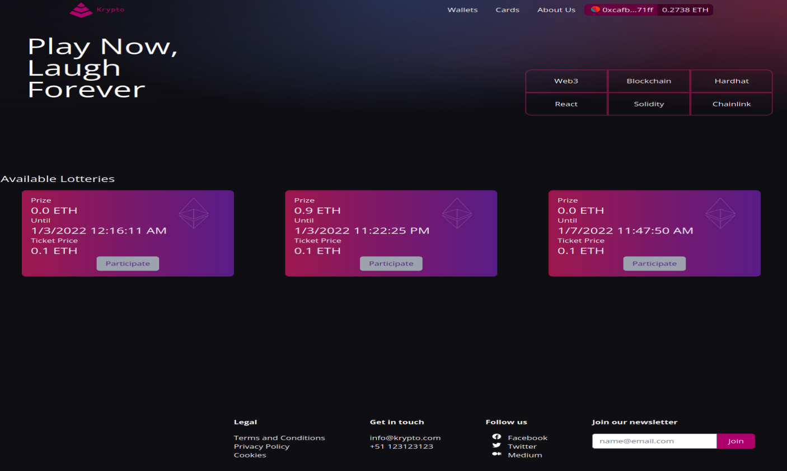

# Crypto Lottery

This repository is intended to be the code base for the tutorial: https://dev.to/johbu/creating-a-lottery-with-hardhat-and-chainlink-385f


### Test Smart Contract locally

1. Clone the repository 

```sh
git clone https://github.com/johburn/crypto-lottery
```

2. Install dependencies

```sh
cd smartcontract
yarn install
```

3. Deploy the smart contract:

```sh
yarn run deploy:local
```

4. Run Tests:

```sh
yarn run test:unit
```

### Test Smart Contract on Testnet

1. Clone the repository 

```sh
git clone https://github.com/johburn/crypto-lottery
```

2. Install dependencies

```sh
cd ../smartcontract
yarn install
```

3. Copy .env.example into a .env and replace the values

```sh
cp .env.example .env
```

4. Deploy the smart contract:

```sh
yarn run deploy:testnet
```

5. Transfer some LINK to your wallet

go to https://faucets.chain.link/rinkeby

6. Fund your contract:

```sh
npx hardhat fund-link --contract <contract address> --fundamount 2000000000000000000 --network rinkeby
```

7. Run Tests:

```sh
yarn run test:integration
```

### Test Smart Contract with Vite App and Postgres

1. Clone the repository 

```sh
git clone https://github.com/johburn/crypto-lottery
```

2. Install Smart Contract dependencies

```sh
cd ../smartcontract
yarn install
```

3. Copy .env.example into a .env and replace the values

```sh
cp .env.example .env
```

4. Deploy the smart contract:

```sh
yarn run deploy:testnet
```

5. Transfer some LINK to your wallet

go to https://faucets.chain.link/rinkeby

6. Fund your contract:

```sh
npx hardhat fund-link --contract <contract address> --fundamount 2000000000000000000 --network rinkeby
```

7. Create a Lottery

```sh
npx hardhat create --contract <contract address> --seconds 600 --price 0.1 --network rinkeby
```

8. Install backend dependencies:

```sh
cd ../backend
yarn install
```

9. Create the database:

```sh
psql -f setup/scripts.sql
```

10. Copy .env.example into a .env and replace the values

```sh
cp .env.example .env
```

11. Copy contracts json to the backend:

```sh
\cp ../smartcontract/deployments/rinkeby/LotteryGame.json ../backend/src/contracts
```

12. Start the backend

```sh
yarn run start
```

13. Copy contracts json to the client:

```sh
\cp ../smartcontract/deployments/rinkeby/LotteryGame.json ../client/src/contracts
```

14. Start Vite App

```sh
yarn run dev
```

15. Participate

Go to localhost 3000 and click on the participate button




16. Declare the winner

```sh
npx hardhat declare-winner --contract <contract address> --lotteryid <lottery id> --network rinkeby
```